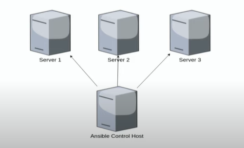
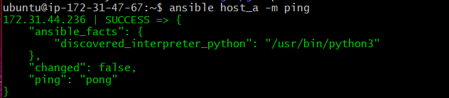
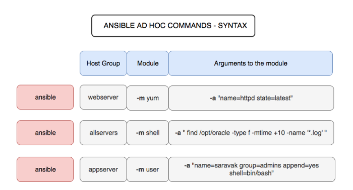
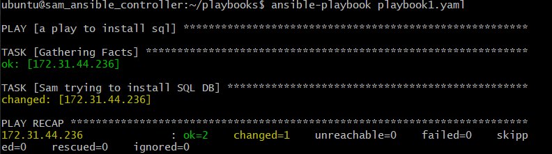
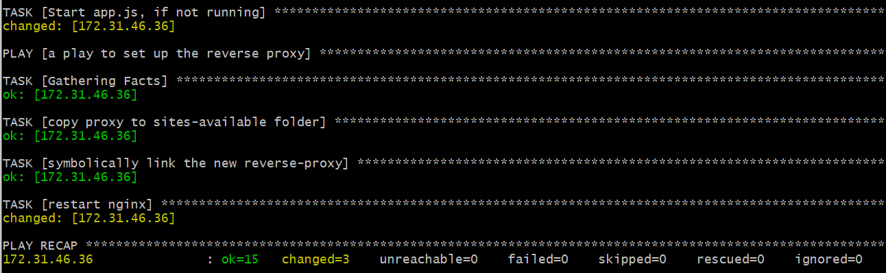

# Infrastructure As Code - Ansible Configuration Management


Writing Infrastructure as code / declaring infrastructure and executing the code to create it. It can create Machines, Environments, or architecture.
Two catagories of tools : Configuration management & Orchestration.

Largely up till now, we have mostly been doing mutable environments. We SSH in, run bash scripts, restart server and get it to the place the machines need to be.

Making something from scratch (IAC) has drawbacks - it may take slightly longer, however in the long run is more efficient as you get more predictable results.

## Configuration Management
- They help configure and test machines to a specific state.
- They also help with the maintaining of this system.
    + Puppet
    + Chef
    + Ansible (Push configuration management)
- They help provision
    + Install/Update packages
    + Config Files
    + Environment variables
    + Start and Enable services
- They have a Controller Agent/Host relationship
- Packer or Ansible --> create AMI

## Orchestration 
Once we have a machine image, orchestration tools are used to deploy these into more complex environments. These tools focus on networking and architecture rather than the configuration of individual machines. They focus more on the environment these machines run.
  - Terraform
  - Ansible
  - Cloud Formation
- They help provision
    - Creating subnets
    - NACL
    - IGW
    - SG
    - Networking components in general
    - Other services (Autoscaling, monitoring)

## Ansible Intro
- Configuration management Software
- Allows you to make changes to machines in a declarative way, through a "push" system
- Ansible host connects to your servers. Sending out its playbooks, that runs through its plays to provision the servers. An ansible host can be anything from your laptop to a github repository.


- Agnostic platform - Less vendor locking
    - With the Ansible abstraction layer, means you can run the code in any environment for any OS and it will know how to install and pERform the operation.
        - e.g 
        - ubuntu uses `apt`
        - Centos uses `dnf` or `yum`
        - IOs Brew others
- Testing strategies
    - If you use ansible language in your playbook - clarification: Not bash
    - Then it will automatically 1) Install/configure 2) Test that it did do the action
    - If the test fails it will break

## Instructions
### Ansible controller
- Set up as an EC2 instance. The security group needs to be unique to the controller and set so we can ssh in from our ip.
- can install ansible and associated dependancies in EC2 using [ansible_bash.sh](https://github.com/samturton2/IAC-Ansible/blob/main/ansible_bash.sh)
- copy your aws ssh key into your ansible controller using scp

### Ansible Host
- To make an ansible host in an ec2 instance we need to create a security group for hosts that allows an ssh in from any instance with the ansible controller security group.

### Connecting to hosts
- ssh into the ansible controller instance
- cd to and edit the hosts file `/etc/ansible/` so we can specify to connect to a host in it, using the private ip
```
[host_a]
172.31.44.236 ansible_connection=ssh ansible_ssh_private_key_file=/home/ubuntu/.ssh/eng74samawskey.pem
```

- To check the connection is made run the following command
```bash
ansible host_a -m ping
```
- You can ping all hosts using
```bash
ansible all -m ping
```
- If successful you should see the following success message


### ad-hoc commands
- Ansible ad-hoc commands can be used in our ansible controller to communicated with our hosts

- get the uptime with
```bash
ansible all -a uptime --become
```
- update and upgrade environments
```bash
ansible host_a -m apt -a "upgrade=yes update_cache=yes" --become
```

## Our first playbook
- This playbook is going to connect our host a to an SQL DB.
- `mkdir playbooks` in the ~/ of the ansible controller
- create a file and look at [sql db connection playbook](https://github.com/samturton2/IAC-Ansible/blob/main/sql_connection.yaml) to see what to include. It would explain the commands in the # comments
- Once created we can run the command below to execute the playbook
```bash
ansible-playbook sql_connection.yaml
```
- If correctly executed teh terminal should show


## App playbook
- We can provision our environment and launch our app in the host from our ansible controller.
- Create the playbook as shown in the [app provisioning playbook](https://github.com/samturton2/IAC-Ansible/blob/main/app_playbook.yaml). The Plays are to:
  - Sync the app file into the machine
  - Install the needed packages and start the app
  - Set up the reverse proxy configuration.
- run the playbook with the command
```bash
ansible-playbook app_playbook.yaml
```
- If ran correctly the terminal should show a success message something like this.


- The app should also be running on port 80

